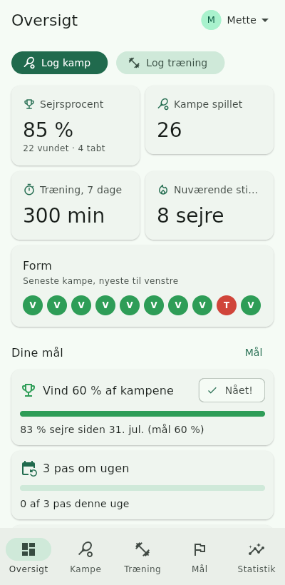
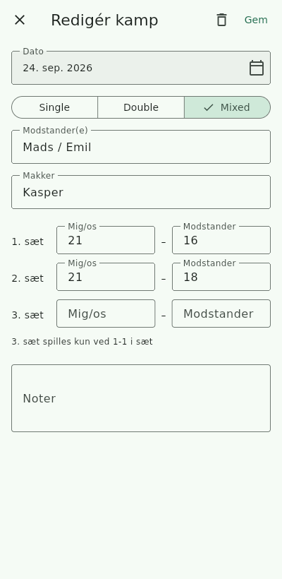
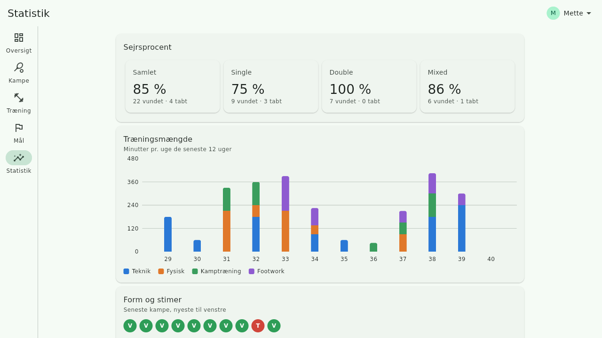
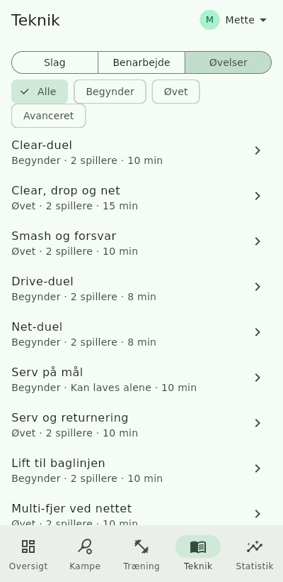
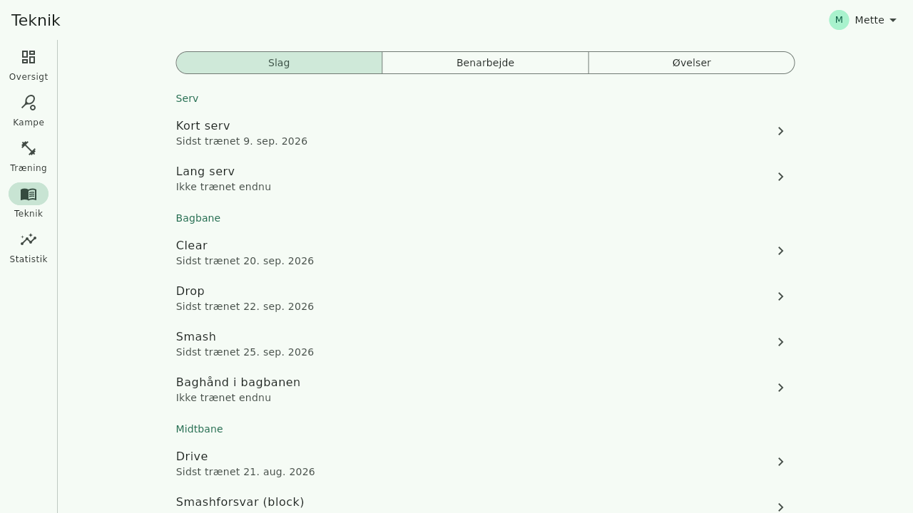
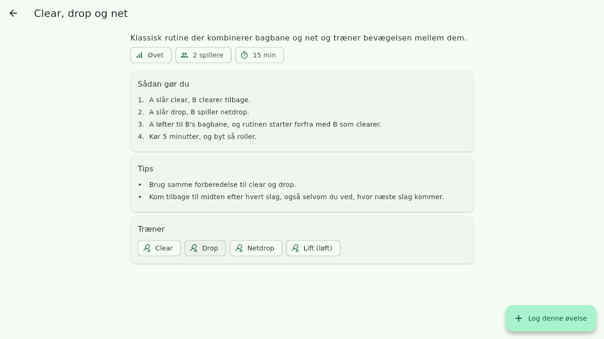
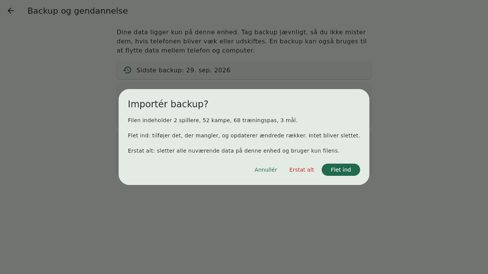

# Badminton-logbog

En app til badmintonspillere og trænere: log kampe og træningspas, sæt mål
og følg udviklingen med statistik. Skrevet i Flutter, så **én kodebase**
kører på Android, iOS, Windows, macOS og Linux.

| Oversigt (mobil) | Kamp (mobil) | Statistik (computer) |
| --- | --- | --- |
|  |  |  |

| Øvelser (mobil) | Teknik (computer) | Øvelse (computer) |
| --- | --- | --- |
|  |  |  |

## Funktioner

- **Spillere**: Bruger du appen selv, har du én profil. Er du træner, kan du
  oprette flere, skifte mellem dem og sammenligne dem i en tabel.
- **Kampe**: single/double/mixed, modstander(e), makker og sætresultater.
  Resultatet tjekkes mod de officielle pointsystemer: **3×15** (standard i
  Danmark fra 1. juli 2026 og hos BWF fra 2027) og **3×21** (tidligere
  standard). Et afvigende resultat giver en advarsel, men kan stadig gemmes.
- **Træningskampe**: markér en kamp som træningskamp. Den giver ingen
  advarsel om pointsystemet og tæller ikke med i sejrsprocent, form og mål.
  På Statistik kan du vælge at medtage træningskampe.
- **Træning**: dato, varighed, type (teknik, fysisk, kamptræning,
  footwork, andet), intensitet 1–5, noter, og hvilke slag, hvilket
  benarbejde og hvilke øvelser der blev trænet.
- **Teknik**: bibliotek med 12 slag og 7 former for benarbejde, samt de
  gældende **regler** (3×15, serv, fejl, let m.m.). Hvert punkt
  har beskrivelse, hvornår det bruges, teknikpunkter, typiske fejl og
  hvornår du sidst trænede det. Dertil kommer 16 øvelser med niveau, antal
  spillere, tid, trin og tips. En øvelse kan logges direkte som
  træningspas. Teksterne tager udgangspunkt i højrehåndede spillere og er
  generel træningsviden. De erstatter ikke en træner.
- **Mål**: træningspas pr. uge, træningsminutter pr. uge eller sejrsprocent,
  med fremskridtsbjælke. Mål oprettes og vises på Oversigten.
- **Statistik**: sejrsprocent samlet og pr. kamptype, træningsminutter pr.
  uge (12 uger, fordelt på type), form over de seneste 10 kampe, aktuel og
  længste stime, pointforskel pr. kamp, resultater mod hver modstander og
  hvilke slag og hvilket benarbejde du træner mest eller har glemt.
- **Backup og gendannelse**: eksportér alle data til en JSON-fil og
  importér den igen. Du kan flette filen ind eller erstatte alt. Oversigten
  minder dig om at tage backup, hvis det er over 30 dage siden.
- **Responsivt layout**: bundnavigation på telefon og sidemenu på bredere
  skærme.

## Installér

**iPhone** (webudgave, gratis og uden App Store):

1. Åbn <https://fupsen.github.io/Badminton-app-ting/> i **Safari**.
2. Tryk på **Del** (firkanten med pilen) og vælg **Føj til hjemmeskærm**.
3. Åbn appen fra ikonet på hjemmeskærmen. **Gør det altid herfra.** Safari
   kan slette data fra hjemmesider, der ikke er brugt i 7 dage, men ikke fra
   apps på hjemmeskærmen.

**Windows:**

1. Gå til [Releases](https://github.com/Fupsen/Badminton-app-ting/releases),
   og hent den nyeste `Badminton-logbog-windows-….zip`.
2. Højreklik på zip-filen, og vælg **Udpak alle**.
3. Dobbeltklik på **badminton_app.exe**. Viser Windows "Windows beskyttede din
   pc", så klik **Flere oplysninger → Kør alligevel**. Appen er ikke signeret
   med et betalt certifikat.

**Flyt data mellem iPhone og Windows:** data ligger på hver enhed for sig.
Brug *Backup og gendannelse*: eksportér på den ene, og importér med *Flet ind*
på den anden.

**Nye versioner:** webudgaven opdateres automatisk, når `main` ændres. En ny
Windows-version laves under Actions → *Udgiv Windows-app* → *Run workflow*.

## Badminton-viden

`docs/viden/` er en dansk vidensbank om regler, teknik, benarbejde, taktik,
fysisk træning og skader, med kildehenvisninger (BWF, Badminton Danmark, Team
Danmark og forskning). Appens tekster og pointregler skal stemme med den.
`CLAUDE.md` sørger for, at Claude bruger vidensbanken i nye sessioner.

## Kom i gang

Kræver [Flutter](https://docs.flutter.dev/get-started/install) 3.47 eller nyere.

```bash
flutter pub get
flutter run              # vælg en tilsluttet enhed/emulator
flutter run -d windows   # eller macos / linux
flutter test
```

Byg til de enkelte platforme med `flutter build apk`, `flutter build ios`,
`flutter build windows`, `flutter build macos` eller `flutter build linux`.
iOS- og macOS-builds kræver en Mac med Xcode, og Windows-builds kræver
Windows.

## Opbygning

```
lib/
  models/      Datamodeller (spiller, kamp, træning, mål) med JSON
  data/        DataStore (lokal JSON-fil), backup-format og fildialoger
  state/       AppState (ChangeNotifier) som skærmene lytter på
  content/     Teknik-bibliotek og regler (dansk)
  logic/       Ren Dart: pointregler, statistik og mål (unit-testet)
  ui/          Skærme og widgets
  l10n/        Tekster (app_da.arb) og genereret oversættelseskode
```

### Data

Alt gemmes lokalt i én JSON-fil i appens support-mappe. Data synkroniseres
ikke automatisk, så **tag backup jævnligt** via spiller-menuen →
*Backup og gendannelse*:

- **Eksportér**: på computeren vælger du, hvor filen gemmes. På telefonen
  åbner delingsmenuen, så du kan gemme i Filer, sende på mail, lægge i Drev
  osv.
- **Importér**: vælg en backup-fil. *Flet ind* tilføjer det, der mangler,
  uden at slette noget. *Erstat alt* overskriver alle data på enheden.
- **Ny telefon**: tryk på *Gendan fra backup* på velkomstskærmen.
- **Flyt data mellem enheder**: eksportér på den ene enhed og importér med
  *Flet ind* på den anden.



Cloud-sync er planlagt. Det tilføjes ved at lave en ny implementation af
`DataStore` i `lib/data/data_store.dart`, uden at skærmene skal ændres.

### Sprog

Appen er på dansk. Alle tekster ligger i `lib/l10n/app_da.arb`. Engelsk
tilføjes ved at oprette `lib/l10n/app_en.arb` med de samme nøgler, køre
`flutter gen-l10n` og fjerne den faste `locale` i `lib/main.dart`.
Teknik-biblioteket ligger i `lib/content/technique_da.dart`. En engelsk
udgave skal have en `technique_en.dart` med de samme id'er.
